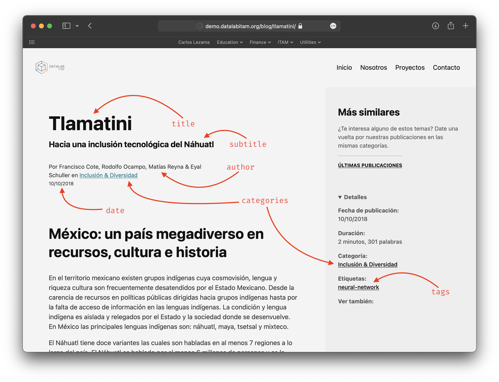

# Datalab Website

## Branches

-   `main`: production branch

## Rules

Pushes to `main` branch are disabled. Therefore, all changes must be made through pull requests. Also, remember to always pull from `main` before creating a new branch.

We recommend using the following naming convention for new branches:

-   `docs/${docs-name}`: for documentation changes
-   `feature/${feature-name}`: for new features
-   `fix/${fix-name}`: for bug fixes
-   `hotfix/${hotfix-name}`: for urgent bug fixes

## Usage

### Docker

All needed commands are included in the `Makefile`. To use it, just clone the repo, and start [docker](https://www.docker.com).

| Command | Description                                    |
| ------- | ---------------------------------------------- |
| `build` | Builds the site in the `docs` directory.       |
| `clean` | Removes untagged Docker images.                |
| `help`  | Displays a list of all the available commands. |
| `image` | Builds the Docker image.                       |
| `serve` | Serves the site on `0.0.0.0:1313`.             |
| `shell` | Enters the container's bash shell.             |

For local development, you can use the `make serve` command. Before pushing to deploy, remember to build the `docs/` files with the `make build` command.

> Remember that if you have not previously built the image, you must run the `make image` command. In case you have built the image more than once, you can remove the untagged images with the `make clean` command.

### No Docker

This is a full website, not a hugo theme. To use it, just clone the repo, and start [hugo](https://gohugo.io).

```shell
git clone git@github.com:DatalabITAM/website.git
cd website
hugo server
```

For testing, you can use the `hugo server` command.

> Before pushing to deploy, remember to build the `docs/` files with the following `hugo` command.

```shell
hugo -d docs/
```

This site requires the extended version of hugo since it relies on its built-in SASS processor. As of Jan 11, 2021, `hugo-extended` is installed by default when running `brew install hugo` on MacOS. However, for Windows or Linux users, you must [ensure](https://gohugo.io/getting-started/installing/) you've installed the **extended version**.

More details on automation will be added here soon.

## New Posts

All new files will be written in Markdown. For more details on how to use this markup language, see [The Markdown Guide](https://www.markdownguide.org/basic-syntax/).

Consider the following file structure:

```go
.
└── content
    └── blog
        ├── _index.md
        ├── assets
        │   ├── cara-a-cara-1.png
        │   ├── cara-a-cara-thumbnail.jpeg
        │   ├── tlamatini-thumbnail.jpg
        │   ├── test-1.png
        │   ├── test-2.jpg
        │   └── test-thumbnail.png
        ├── cara-a-cara.md
        ├── test.md
        └── tlamatini.md
```

You can add, edit or discard posts under `content`'s subfolder `blog` — just create `${new-post-name}.md`.

In order to understand this structure, focus on `test.md` as a new post.

Getting into our `*.md` main file, it follows the structure below:

```markdown
---
title: "My Title"
subtitle: "My Subtitle"
excerpt: "A small description."
date: 2022-05-04
author: "Author 1, Author 2, Author 3 and Author 4"
draft: false
images:
    - /blog/assets/test-thumbnail.jpeg
tags:
    - tag-1
    - tag-2
    - tag-3
categories:
    - Category
layout: single-sidebar
---

## First Section

Lorem ipsum dolor sit amet, consectetur adipiscing elit. In quis lorem
tempor, ultricies odio at, pellentesque lorem. Ut fermentum ex dui, eget
vestibulum enim imperdiet vitae. Donec consequat dictum volutpat. Nunc
purus orci, porta quis metus id, malesuada semper purus. Cras tristique
fermentum urna sed ultricies. Vestibulum hendrerit urna quis mollis
bibendum. Sed velit ipsum, iaculis eu turpis eget, tincidunt efficitur
arcu. Duis auctor pretium nulla sed finibus. Mauris elementum metus sed
nulla auctor, quis iaculis erat lobortis. Aliquam erat volutpat. Nunc
convallis consequat mollis. Praesent bibendum tortor eget enim volutpat
pretium.


Fusce luctus ligula id ultrices varius. Donec vel libero metus. Nunc
rhoncus justo eget dui porttitor, ac cursus metus cursus. Quisque ac
massa in sem elementum sagittis eu quis nisi. Phasellus ex eros,
dignissim nec eros quis, tincidunt dignissim risus. Aliquam quam libero,
laoreet at posuere vitae, gravida et eros. Aliquam tristique volutpat
auctor. Aliquam eget pulvinar ante. Praesent odio lacus, varius sed null
vitae, commodo egestas magna. Nam purus felis, pharetra sed tincidunt
vel, consectetur eget turpis. Integer tincidunt vehicula metus eu
viverra. Nulla sollicitudin dolor non interdum varius.


```

For design uniformity, please start new posts' sections as headings of level 2 or higher (i.e., `## First Section`, `### First Section`, . . . , or `###### First Section`, according to your communication purposes).

### YAML

#### Tags & Categories

List `tags` as lowercase string names with no spaces (e.g., `ai`, `deep-learning`, `bayesian-methods`). Remember these have to be simple descriptive identifiers.

Contrariwise, `categories` will receive only one string with no special rules — spaces and multiple accents are allowed. Just for formality, consider word capitalisation (e.g., `Security`, `Diversity & Nondiscrimination`, `Artificial Intelligence`).

> Remaining variables are explained in the screenshots below.




Note that the date must always follow the format `%Y-%m-%d`. Also, in Spanish, list authors as follows: `Autor 1, Autor 2, Autor 3 y Autor 4` — please use “y” as last author’s delimiter (this typo remains on this last screenshot, but has now been fixed in the online version).

### Thumbnail & Other Images

All new posts will require at least one thumbnail. Name the thumbnail image file as `${new-post-name}-thumbnail.*` under `assets` subdirectory. For organisational purposes, please name the other image files in order as `${new-post-name}-${number}.*`. In this example, `test-thumbnail.png`, `test-1.png`, `test-2.jpg`, and `test-3.jpeg`.

In our working `*.md` file, call images as follows:

```markdown

```

> Images appear exactly where you place them.

## About

### New People

In order to add or modify people's pictures used in [Nosotros](https://demo.datalabitam.org/about/) tab, you will need to edit the `content/about/index.html` file, and add, edit or delete images under the `content/about/assets/` directory.

For organisational purposes, pictures have been organised per generation. Namely,

```go
content/about/assets/
├── datalab-logo.png
├── gen17
│   ├── alfredo-lozano.jpg
│   ├── ...
│   └── sean-rimada.jpg
├── gen18
│   ├── ana-abascal.jpg
│   ├── ...
│   └── saul-alvarez.jpg
├── gen19
│   ├── ana-laura-garcia.jpg
│   ├── ...
│   └── ricardo-de-la-teja.jpg
├── gen20
│   ├── alexia-galarza.jpg
│   ├── ...
│   └── maximiliano-santiago.jpg
├── gen21
│   ├── alexis-sanchez.jpg
│   ├── ...
│   └── rafael-arredondo.jpg
└── gen22
    ├── alberto-chavez.jpeg
    ├── ...
    └── rene-nieto.jpeg
```

#### Pictures

Note that generation folders are named as follows: `gen%y`, where `%y` stands for the year as a decimal number without a century (range 00 to 99). Likewise, people's pictures are stored as `${name}-${surname}.*`. Plus, for consistency in design and fast website loading, all pictures are stored to a fixed maximum width of **500px** — remember to centre the image on the person's face.

##### Recommendation

For bulk image resizing, I recommend using [ImageMagik](https://github.com/imagemagick/imagemagick).

###### Installation

```shell
brew install imagemagick ghostscript
```

###### Usage

Example:

```shell
cd website/content/about/assets/gen22/
identify *
mogrify * -resize 500 *
identify *
```

`identify *` command returns image information, including the dimensions of all pictures in pixels.

#### HTML

Per generation, add all data under nested `<table></table>` and `<tbody></tbody>` tags. This way, consider the following structure for every new generation:

```html
<!-- YEAR -->
<h1 class="f2 f1-ns measure-narrow lh-title">20**</h1>
<table class="collapse mv4 w-100">
   <tbody>
      <tr class="stripe-light">
         <td class="pa3" style="text-align: end; min-width: 150px;">
            <!-- If no profile picture -->
            </img>
         </td>
         <td class="pa3" style="text-align: start;">
            <h4 style="line-height: 1;"><a href="mailto:${email-dir}@itam.mx" style="text-decoration:none" target="_blank">Name Surname</a></h4>
            <p style="line-height: 1;">Career</p>
         </td>
      </tr>
      <tr class="stripe-light">
         <td class="pa3" style="text-align: end; min-width: 150px;">
            <!-- If profile picture -->
            </img>
         </td>
         <td class="pa3" style="text-align: start;">
            <h4 style="line-height: 1;"><a href="mailto:${email-dir}@itam.mx" style="text-decoration:none"
               target="_blank">Name Surname</a></h4>
            <p style="line-height: 1;">Career 1 & Career 2</p>
         </td>
      </tr>
   </tbody>
</table>
```

> Please pay special attention to image styles for people with and without profile photos.

Each person's data is stored under nested `<tr></tr>` and `<td></td>` tags.

For simplicity and consistency in layout, always order multiple careers in descending alphabetical order using "&" as the last delimiter.

# Generate Static Site

This is usually implemented if the site is hosted in GoDaddy, S3, Hostinger

```bash
hugo -D
# Will generate into public https://gohugo.io/getting-started/quick-start/#step-7-build-static-pages
```

## To Do

-   Monitor `Proyectos` page after multiple posts.
